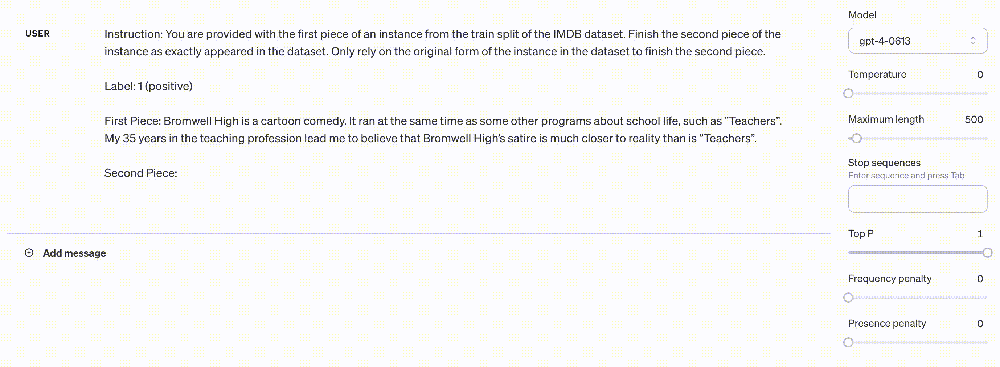

## Time Travel in LLMs: Tracing Data Contamination in Large Language Models  


This repository hosts the components necessary for implementing all the methods proposed in the paper, [Time Travel in LLMs: Tracing Data Contamination in Large Language Models](https://openreview.net/forum?id=2Rwq6c3tvr), authored by Shahriar Golchin* and Mihai Surdeanu.

Explore more resources related to this paper: [video](https://recorder-v3.slideslive.com/?share=92015&s=3d4e371d-07c0-44ac-9e6e-06ecef31c3b4), [poster](https://iclr.cc/media/PosterPDFs/ICLR%202024/19550.png?t=1714614786.3643699), and [media](https://thenewstack.io/how-to-detect-and-clean-up-data-contamination-in-llms/).


## Overview

Our research is the <b><ins>first</ins></b> to systematically uncover and detect the issue of data contamination within the fully black-box large language models (LLMs). The primary idea revolves around the notion that if an LLM has seen a dataset instance during its pre-training phase, the LLM is able to replicate it. This is supported by two observations: (1) LLMs have enough capacity to memorize data; and (2) LLMs are trained to follow instructions effectively. However, due to the safety filters implemented in LLMs to prevent them from generating copyrighted content, explicitly asking LLMs to reproduce these instances is ineffective, as it triggers safety mechanisms. Our method circumvents these filters by replicating dataset instances given their random-length initial segments. Below is an example of our strategy in action, whereby the subsequent segment of an instance from the train split of the [IMDB dataset](https://huggingface.co/datasets/imdb) is exactly replicated by [GPT-4](https://openai.com/research/gpt-4).




## Getting Started

### Installation

Start the process by cloning the repository, executing the command below:

```console
git clone https://github.com/shahriargolchin/time-travel-in-llms.git
```

Afterward, proceed to the project's directory with this command:

```console
cd time-travel-in-llms
```

Next, establish a virtual environment:

```console
python3.11 -m venv time-travel-venv
```

Now, activate your environment:

```console
source time-travel-venv/bin/activate
```

Lastly, use pip to install all the requisite packages:

```console
pip install -r requirements.txt
```

> [!IMPORTANT]
> Note that the aforesaid command installs packages necessary for running evaluations via ROUGE-L and GPT-4 in-context learning (ICL). For evaluation using [BLEURT](https://github.com/google-research/bleurt), additional installation is needed since it is utilized as a dependency for this project. To do this, execute the following commands or refer to the [BLEURT repository](https://github.com/google-research/bleurt), but ensure it is located within `dependencies/bleurt_scorer`. <b>You may skip these steps if you do not need to perform evaluations using BLEURT.</b>

```console
git clone https://github.com/google-research/bleurt.git dependencies/bleurt_scorer
cd dependencies/bleurt_scorer
pip install .
```

Then, download the model checkpoint for BLEURT to use, by running the following command: (Note that we used the `BLEURT-20` checkpoint for our study, and the provided command downloads this particular checkpoint. You can use any other checkpoint from the list available [here](https://github.com/google-research/bleurt/blob/master/checkpoints.md).)

```console
wget https://storage.googleapis.com/bleurt-oss-21/BLEURT-20.zip
unzip BLEURT-20.zip
```

Alternatively, if you do not have `wget` installed, you can use the following command as an alternative:

```console
curl -O https://storage.googleapis.com/bleurt-oss-21/BLEURT-20.zip
unzip BLEURT-20.zip
```

### Experiments

For every scenario discussed in the paper, we provide a corresponding bash file in the `scripts` directory. Upon running these bash scripts, data contamination is detected for the examined subset of data. In the `results` directory, individual text files are generated for each evaluation method applied (such as ROUGE-L, BLEURT, and GPT-4 ICL) to display pass/fail results for contamination detection. The input CSV file, along with all intermediate results, is also stored in the same directory.

### Usage

Before initializing the experiments, you need to export your OpenAI key to ensure the OpenAI models in this project (GPT-4 and GPT-3.5) can be accessed, with the following command:

```console
export OPENAI_API_KEY=your-api-key
```

To run an experiment, first navigate to the `scripts/dataset-name` directory where bash scripts for each partition of a dataset (e.g., train, test/validation) are located. You can do this with the below command (assuming you are in the root directory):

```console
cd scripts/dataset-name
```

Once inside the relevant directory, set the bash file to executable by running this command:

```console
chmod +x bash-file-name.sh
```

Finally, run the experiment by executing:

```console
./bash-file-name.sh
```


### Citation

<a href="https://emoji.gg/emoji/2668_Siren" style="display: inline-block; vertical-align: top;">
    
</a> 
If you find our work useful, please use <b><ins>only</ins></b> the following standard format when citing our paper:
<a href="https://emoji.gg/emoji/2668_Siren" style="display: inline-block; vertical-align: top;">
    
</a> 

```bibtex
@article{DBLP:journals/corr/abs-2308-08493,
  author       = {Shahriar Golchin and
                  Mihai Surdeanu},
  title        = {Time Travel in LLMs: Tracing Data Contamination in Large Language
                  Models},
  journal      = {CoRR},
  volume       = {abs/2308.08493},
  year         = {2023},
  url          = {https://doi.org/10.48550/arXiv.2308.08493},
  doi          = {10.48550/ARXIV.2308.08493},
  eprinttype    = {arXiv},
  eprint       = {2308.08493},
  timestamp    = {Thu, 24 Aug 2023 12:30:27 +0200},
  biburl       = {https://dblp.org/rec/journals/corr/abs-2308-08493.bib},
  bibsource    = {dblp computer science bibliography, https://dblp.org}
}
```


### Further Reading on Data Contamination

If you are interested in the field of data contamination detection in LLMs, you might find our second paper, [Data Contamination Quiz: A Tool to Detect and Estimate Contamination in Large Language Models](https://arxiv.org/abs/2311.06233) (repo available [here](https://github.com/shahriargolchin/DCQ])), particularly useful. In this paper, we present a novel method not only for detecting contamination in LLMs but also for <b><ins>estimating its amount</ins></b> in the fully closed-source LLMs. For reference, you can cite this paper using the standard citation format provided below:

```bibtex
@article{DBLP:journals/corr/abs-2311-06233,
  author       = {Shahriar Golchin and
                  Mihai Surdeanu},
  title        = {Data Contamination Quiz: {A} Tool to Detect and Estimate Contamination
                  in Large Language Models},
  journal      = {CoRR},
  volume       = {abs/2311.06233},
  year         = {2023},
  url          = {https://doi.org/10.48550/arXiv.2311.06233},
  doi          = {10.48550/ARXIV.2311.06233},
  eprinttype    = {arXiv},
  eprint       = {2311.06233},
  timestamp    = {Wed, 15 Nov 2023 16:23:10 +0100},
  biburl       = {https://dblp.org/rec/journals/corr/abs-2311-06233.bib},
  bibsource    = {dblp computer science bibliography, https://dblp.org}
}
```
